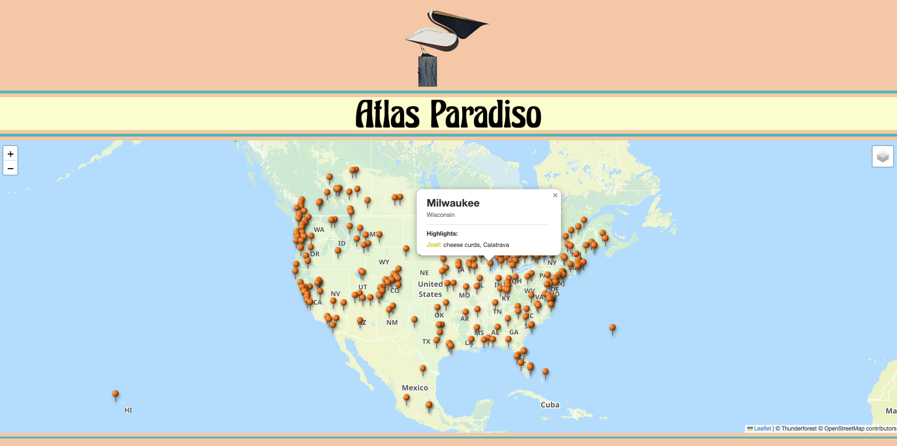
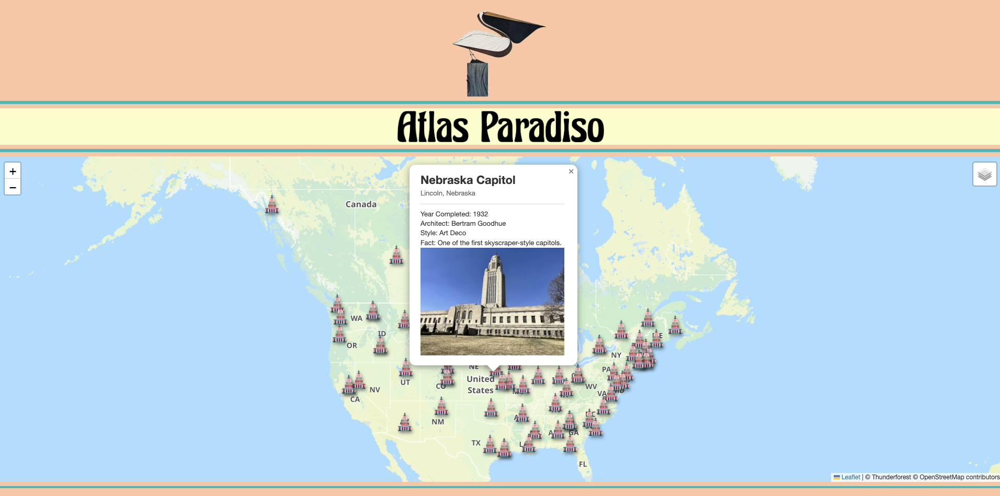
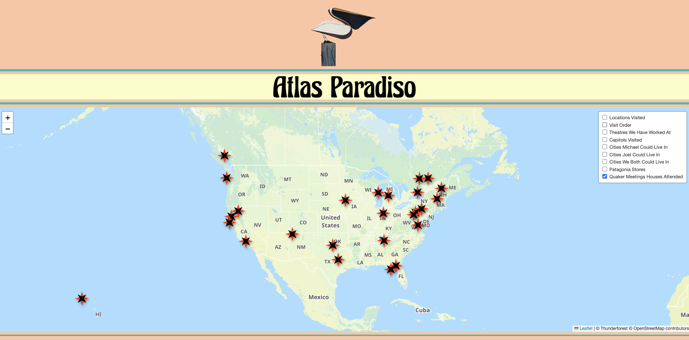
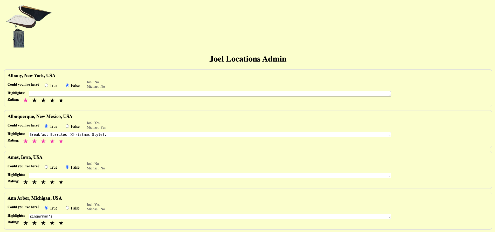
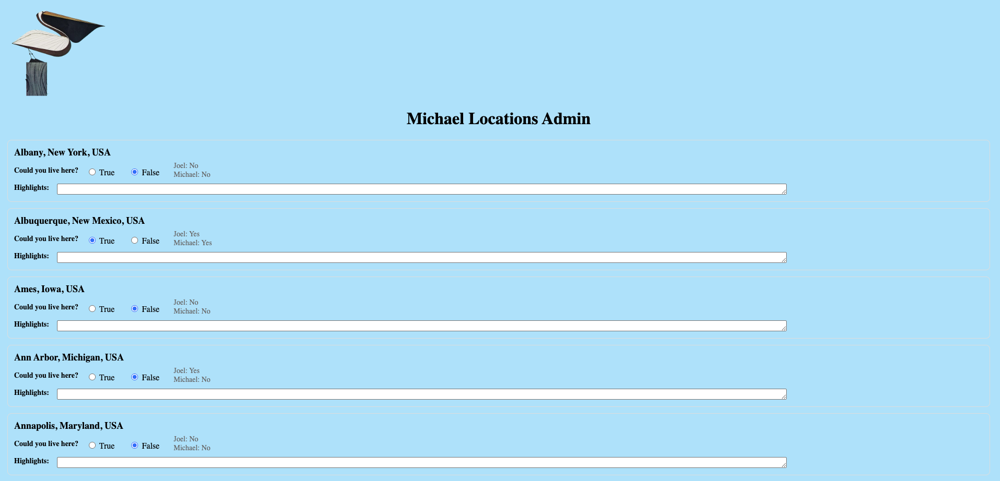

# Atlas Paradiso 🌎🗺️

An interactive personal travel atlas built with **FastAPI**, **JavaScript**, **Leaflet**, and **PostgreSQL**.

Atlas Paradiso transforms travel experiences into an interactive map. It allows locations to be explored visually, with custom markers, travel routes, ratings, highlights, and geographic information.

---

## Features

- 🗺️ Interactive map powered by Leaflet
- 📍 Custom location markers
- 🔢 Numbered markers showing travel order
- 🛣️ Routes connecting visited locations
- ⭐ Personal location ratings
- ✨ Location highlights and notes
- 🖼️ Location images and custom popups
- 🌎 Geographic statistics:
  - Total locations
  - Countries visited
  - States/provinces visited
  - Capitols visited
- 🔐 Admin interfaces for managing location information

---

## Screenshots








---

## Tech Stack

### Backend
- Python
- FastAPI
- PostgreSQL
- SQLAlchemy

### Frontend
- JavaScript
- HTML/CSS
- Leaflet.js

### Mapping
- Leaflet
- ESRI Typographic tiles
- OpenStreetMap data

---

## Project Structure

```
Atlas-Paradiso/
├── README.md
├── api
│   ├── database.py
│   ├── main.py
│   ├── routers
│   └── services
├── backend
│   └── scripts
├── database
│   └── schema
├── frontend
│   ├── assets
│   ├── css
│   ├── images
│   ├── index.html
│   ├── joel_admin.html
│   ├── js
│   └── michael_admin.html
├── maps
│   ├── generate_capitol_map.py
│   ├── generate_joel_could_live_map.py
│   ├── generate_theatre_map.py
│   ├── generate_visit_order_map.py
│   └── output
├── notes.md
├── paradise_atlas_noted.md
├── requirements.txt
├── resources
│   └── tables.sql
├── screenshots
```

---

## Database

Atlas Paradiso stores location information including:

- Location name
- Coordinates
- Country
- State/province
- Visit order
- Ratings
- Highlights
- Images
- Geographic classifications

Example:

```json
{
  "location": "Tokyo",
  "country": "Japan",
  "visit_number": 12,
  "joel_star_rating": 5,
  "joel_highlights": "Amazing food and neighborhoods"
}
```

---

## Future Improvements

- [ ] Mobile optimization
- [ ] Location search
- [ ] Filtering by country/state/category
- [ ] Interactive travel timelines
- [ ] Expanded photo galleries
- [ ] Additional map styles
- [ ] User authentication

---

## About Atlas Paradiso

Atlas Paradiso began as a way to combine my interests in travel, geography, photography, and software development into one project.

The goal is to create a personal digital atlas where memories, journeys, and places can be explored through an interactive map.

---

## Author

**Joel Karie**

Software Developer | GIS Enthusiast | Traveler

## License
This project is licensed under the MIT License - see the LICENSE file for details.